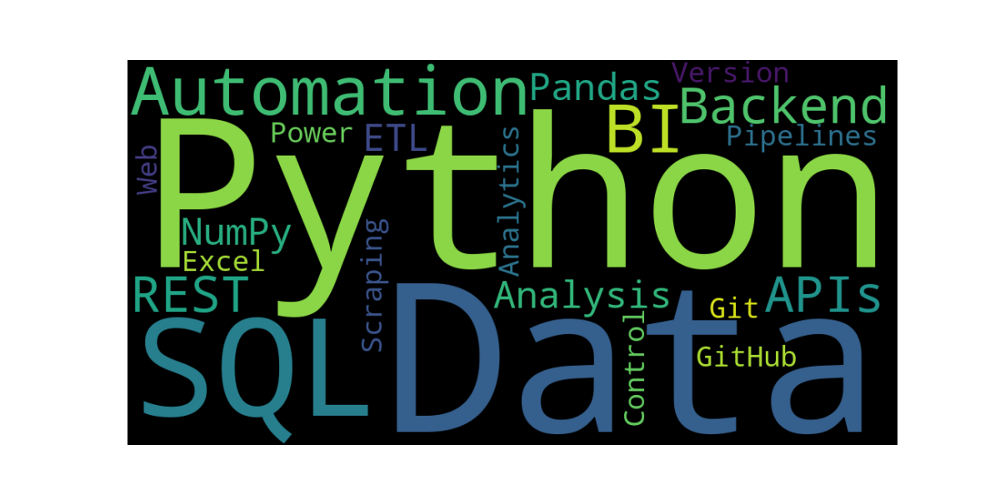

# ☁️ Nuvem de Palavras com Python

Este projeto demonstra a criação de uma **WordCloud (nuvem de palavras)** utilizando **Python**, com foco na representação visual de tecnologias, ferramentas e conceitos relacionados a **Back-end** e **Análise de Dados**.

A nuvem é gerada de forma programática, reforçando o uso de Python para **automação**, **tratamento de dados** e **geração de artefatos visuais reutilizáveis**, aplicáveis em portfólio e documentação técnica.

---

## 🧠 WordCloud de Tecnologias



---

## 🔍 Tecnologias e Conceitos Representados

A WordCloud destaca conhecimentos e práticas como:

- **Python e SQL** aplicados ao desenvolvimento back-end e análise de dados  
- **Pandas e NumPy** para manipulação e análise de dados  
- **ETL e automação de processos**  
- **APIs REST e integração de sistemas**  
- **Web Scraping** para coleta de dados  
- **Excel e Power BI** como apoio à análise e BI  
- **Git e GitHub** para versionamento e organização de projetos  

---

## 🚀 Objetivo do Projeto

Este repositório tem como objetivo demonstrar, de forma prática:

- Uso de bibliotecas Python aplicadas a dados
- Organização e estruturação de projetos
- Geração de imagens a partir de código
- Separação entre código e dados de entrada
- Publicação profissional no GitHub

O projeto faz parte do meu processo de evolução como **desenvolvedor back-end com foco em dados**.

---

## 🌸 Geração da WordCloud com Python

A WordCloud é gerada a partir de um arquivo externo (`tecnologias.txt`), permitindo atualizar as palavras exibidas **sem necessidade de alterar o código**, seguindo boas práticas de desenvolvimento.

---

### 📄 Script Python

```python
from wordcloud import WordCloud
import matplotlib.pyplot as plt

# Abre o arquivo de texto e lê todo o conteúdo
# encoding="utf-8" evita problemas com acentuação
with open("tecnologias.txt", encoding="utf-8") as arquivo:
    texto = arquivo.read()

# Cria a nuvem de palavras com configurações visuais
wc = WordCloud(
    width=1000,               # Largura da imagem
    height=500,               # Altura da imagem
    background_color="black", # Cor de fundo
    colormap="viridis"        # Paleta de cores
).generate(texto)

# Exibe a WordCloud na tela
plt.figure(figsize=(12, 6))
plt.imshow(wc, interpolation="bilinear")
plt.axis("off")
plt.show()

# Salva a imagem gerada em arquivo PNG
wc.to_file("wordcloud.png")


wordcloud_dados/
├── Assets/
│   ├── wordcloud_1.png
│   └── wordcloud.png
│
├── rafael.python.nuvem.palavras/
│   └── gerar_wordcloud.py
│
├── README.md
├── requirements.txt
├── tecnologias.txt
└── wordcloud.png

```

### 📂 Estrutura do Projeto

- **Assets/**: imagens geradas e utilizadas no README
- **rafael.python.nuvem.palavras/**: script Python responsável por gerar a WordCloud
- **tecnologias.txt**: arquivo de entrada com as palavras-chave
- **wordcloud.png**: imagem final gerada pelo script
- **requirements.txt**: dependências do projeto
- **README.md**: documentação do projeto


